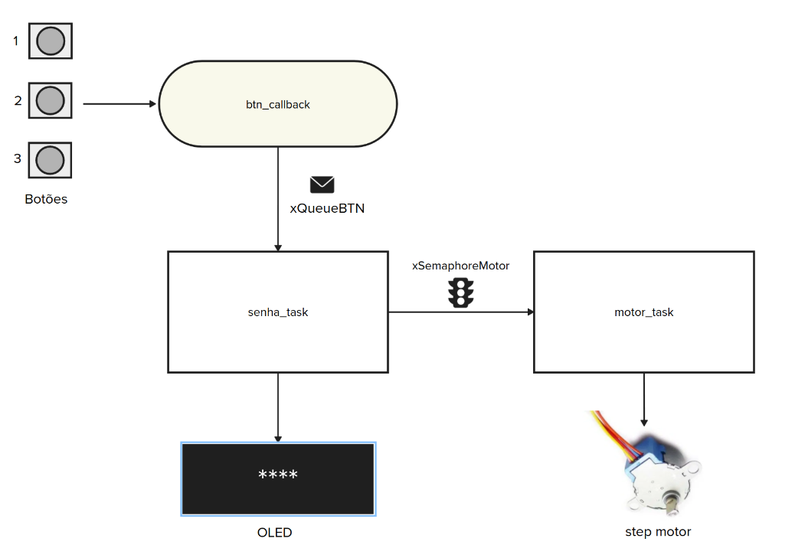

# Simulado - AV - pico - LED RGB

> LEIA TODOS OS PASSOS ANTES DE SAIR FAZENDO, TENHA UMA VISÃO GERAL DO TODO ANTES DE COMECAR .

Nesta avaliação vocês irão desenvolver um protótipo de uma fechadura eletrônica!. 

## Entrega

O comportamento esperado é o seguinte: O sistema deve aguardar por uma sequência de 4 apertos dos botões e verificar se uma senha foi corretamente digitada, a cada vez que o usuário aperta o botão, o OLED deve exibir um novo `*`, ao completar 4 dígitos, o sistema deve verificar se a sequencia foi correta e então abrir a fechadura (girar o motor).

Vocês devem desenvolver o firmware como indicado a seguir:

Onde:

- `btn_callback`:
  - Callback dos botões da placa OLED
  
- `xQueueBTN`
    - Fila com informacoes de quais botões foram apertados
    
- `task_senha` 
    - Tarefa que faz a leitura dos botões, verifica a senha e ativa ou não o motor de passos (para abrir a fechadura)
    - Exibe no OLED o `****` referente a senha sendo digitada
    
- `xSemaphoreMotor`
    - Semáforo que define se o motor vai girar 180 graus

- `motor_task`
    - Task que faz o motor girar 180 graus quando semáforo liberado
    
## Rubrica

Segue as seguintes rubricas

- [ ] `senha_task` e `motor_task` implementadas
- [ ] Botões da OLED funcionando com interrupcão (IRS)
- [ ] `xQueueBTN` usada para envio de qual botão foi apertado da IRS
- [ ] `xSemaphoreMotor` controla quando o motor vai girar
- [ ] `senha_task` verifica a senha e determina se motor deve ou não girar 
- [ ] `motor_task` quando semáforo liberado, rotaciona o motor em 180 graus
- [ ] `OLED` exibe o tamanho da senha digitada em `*`, deve limpar quando senha digitada

Colocar ?: 

- Timeout na senha?
